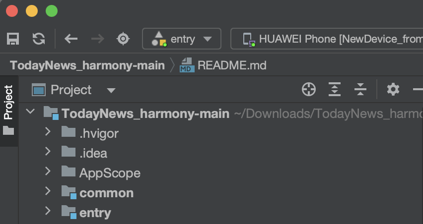
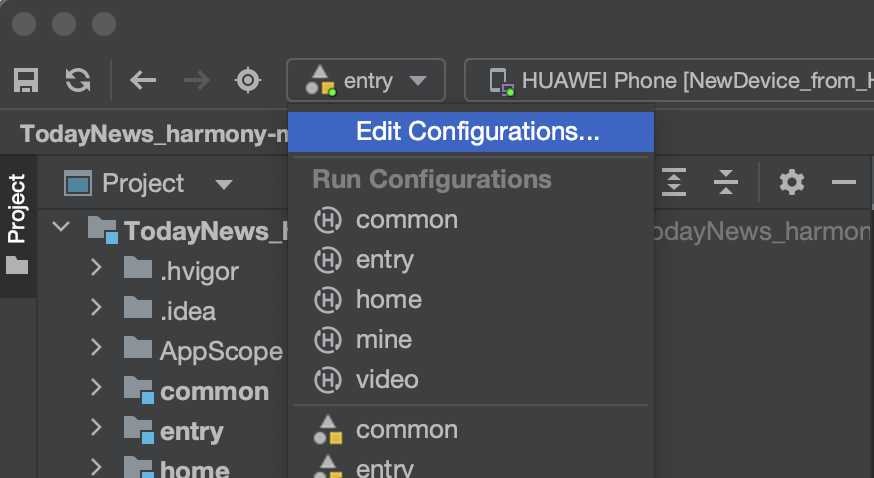
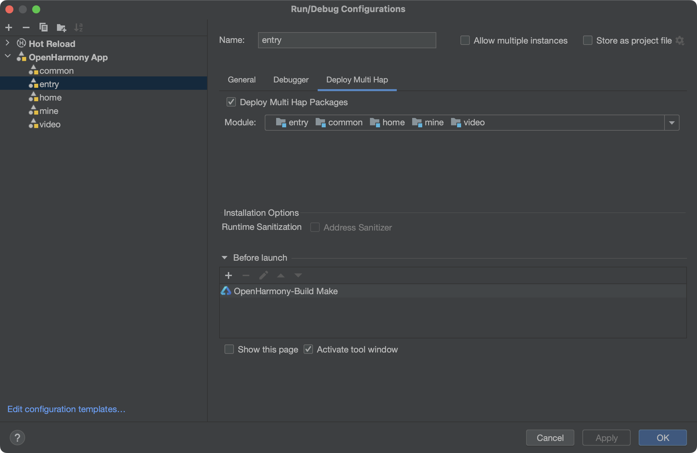
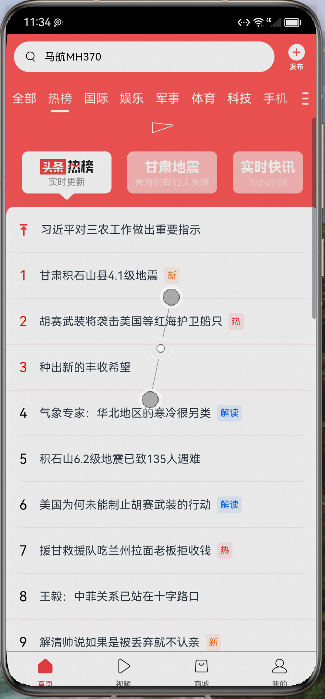

# TodayNews_harmony

# 一、运行环境

## 开发工具：

DevEco Studio 3.1.1 Release

Build Version: 3.1.0.501, built on June 20, 2023

Runtime version: 17.0.6+10-b829.5 x86_64

VM: OpenJDK 64-Bit Server VM by JetBrains s.r.o.

## 运行前准备：
1、入口module选择 entry

2、修改配置

3、选择其他依赖项

# 二、运行效果

## 图片展示

## 视频地址在markdownImg文件夹里面

1、下拉刷新

<video height="800" width="400" src ="./markdownImg/11.mp4" frameborder="1" allowfullscreen> </video>

2、tabBar切换

<video height="800" width="400" src ="./markdownImg/22.mp4" frameborder="1" allowfullscreen> </video>

3、上拉加载

<video height="800" width="400" src ="./markdownImg/33.mp4" frameborder="1" allowfullscreen> </video>

4、视频

<video height="800" width="400" src ="./markdownImg/44.mp4" frameborder="1" allowfullscreen> </video>

4、我的

<video height="800" width="400" src ="./markdownImg/55.mp4" frameborder="1" allowfullscreen> </video>
